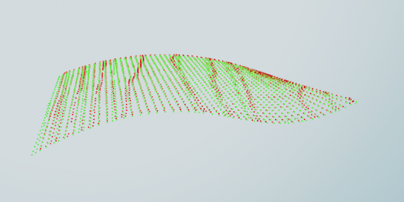
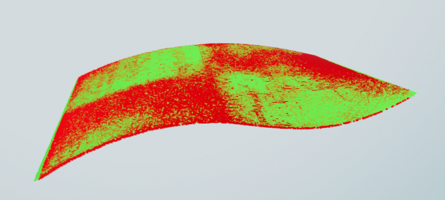

RANSAC:

```
python3 registration_ransac.py testData/source/Wave_mesh.ply testData/target/Wave.ply --voxel_size 50 --distance_multiplier 1.5 --distance_threshold_icp
```

(note: the voxel size and distance multiplier (for RANSAC) and the ICP distance threshold are imporant parameters. try playing around with them and see how it affects the fitness score & RMSE)

results:

RANSAC:


ICP:

